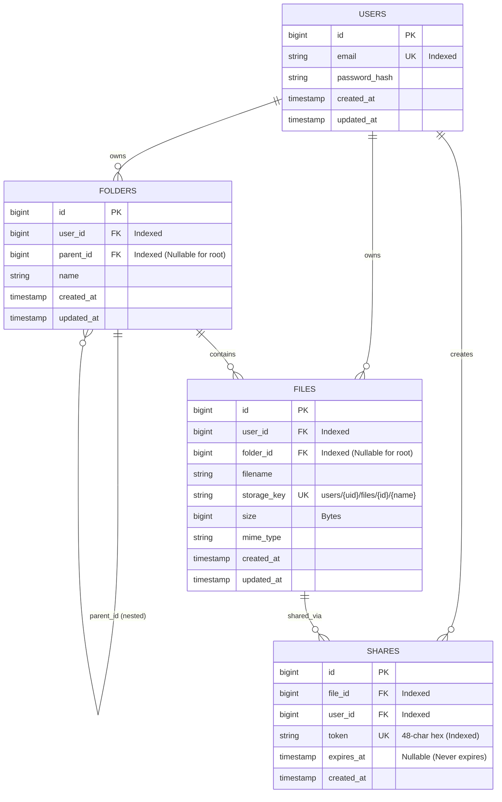

# 📦 CloudBox — Production-Grade Cloud File Storage Platform

CloudBox is a high-performance, Google Drive-inspired cloud file storage platform engineered for backend reliability and developer clarity. It features an idiomatic **Go (Gin)** REST API, **PostgreSQL** relational metadata, **Redis** cache-aside & rate limiting, **MinIO** S3-compatible object storage, and a modern **Next.js (TypeScript)** drive interface.

---

## 📑 Table of Contents
1. [System Architecture](#-system-architecture)
2. [Tech Stack & Rationale](#-tech-stack--rationale)
3. [Database Schema](#-database-schema)
4. [Core Architectural Flows](#-core-architectural-flows)
   - [Direct-to-S3 Presigned Uploads](#1-direct-to-s3-presigned-uploads)
   - [Secure File Streaming & Presigned Downloads](#2-secure-file-streaming--presigned-downloads)
   - [Circular Folder Hierarchy Guard](#3-circular-folder-hierarchy-guard)
   - [Temporary Public Shares](#4-temporary-public-shares)
   - [Redis Cache-Aside & Rate Limiting](#5-redis-cache-aside--rate-limiting)
5. [Project Structure](#-project-structure)
6. [REST API Reference](#-rest-api-reference)
7. [Getting Started & Local Setup](#-getting-started--local-setup)
8. [Testing & Verification](#-testing--verification)
9. [Key Backend Interview Talking Points (₹14 LPA Focus)](#-key-backend-interview-talking-points-14-lpa-focus)

---

## 🏛️ System Architecture


---

## 💡 Tech Stack & Rationale

| Layer | Component | Choice | Engineering Rationale |
|---|---|---|---|
| **API Framework** | Backend Core | **Go (Golang) + Gin** | Blazing-fast execution, tiny memory footprint, compiled static binary, and first-class native concurrency primitives (`goroutines` and channels). |
| **Relational DB** | Metadata & Structure | **PostgreSQL (GORM)** | ACID compliance, transactional integrity for folder cascading deletes, foreign keys, and indexes on `(owner_id, folder_id)`. |
| **Object Storage** | Binary Storage | **MinIO (S3 API)** | Complete AWS S3 API compatibility. Keeps large binary payloads out of the relational database and web application servers. |
| **In-Memory Cache** | Cache & Rate Limiting | **Redis** | Sub-millisecond latency for metadata cache-aside lookups and atomic sliding window rate limiting. |
| **Frontend** | User Interface | **Next.js 14 + Tailwind** | Responsive, clean Google Drive-style UI with breadcrumb folder navigation, preview modal, and quota meter. |
| **Logging** | Observability | **Uber Zap** | Zero-allocation structured JSON logging for high-throughput production tracing. |

---

## 🗄️ Database Schema

PostgreSQL stores file and folder metadata; binary payloads are stored in S3/MinIO.



---

## 🔄 Core Architectural Flows

### 1. Direct-to-S3 Presigned Uploads
To prevent multi-gigabyte uploads from saturating Go API memory and network bandwidth:
1. **Request Upload URL:** Client calls `POST /api/files/upload-url` with `{ filename, mime_type, size, folder_id }`.
2. **Quota Check:** Go checks if `current_storage + size > 50 GB`. If exceeded, rejects with `400 STORAGE_LIMIT_EXCEEDED`.
3. **Generate Presigned URL:** Go signs an S3 `PUT` presigned URL with a 15-minute expiration and returns `{ upload_url, storage_key }`.
4. **Direct Client Upload:** Browser uploads directly to MinIO/S3 via `PUT <upload_url>`.
5. **Confirm Upload:** Browser notifies Go via `POST /api/files/confirm-upload`. Metadata is recorded in PostgreSQL, Redis cache is invalidated, and background thumbnail/metadata tasks are enqueued.

### 2. Secure File Streaming & Presigned Downloads
Files are never stored as public S3 objects:
- **Authenticated Stream:** `GET /api/files/:id/download` verifies user ownership and streams file bytes with `Content-Disposition: attachment`.
- **Presigned Download URL:** Go signs an S3 `GET` presigned URL with a 15-minute TTL, ensuring links cannot be shared permanently or accessed without authorization.

### 3. Circular Folder Hierarchy Guard
Preventing circular references (e.g. moving `/A` into `/A/B/C`, which causes infinite loops or orphans):
- `FolderService.MoveFolder(id, newParentID)` traverses the folder tree using BFS/DFS.
- If `newParentID` is equal to `id` or is found in `GetDescendantFolderIDs(id)`, the API rejects the operation with `409 CONFLICT: cannot move a folder into its own subfolder`.

### 4. Temporary Public Shares
- Users can create a shareable link with expiration (`1h`, `24h`, `7d`, or `never`).
- A cryptographically secure 48-character token is generated (`crypto/rand`).
- Public recipients visit `/shared/:token` (unauthenticated). The server validates the expiration timestamp and generates a short-lived presigned S3 download URL.

### 5. Redis Cache-Aside & Rate Limiting
- **Cache-Aside:** File metadata queries (`GET /api/files/:id`) query Redis first. On cache miss, GORM fetches from PostgreSQL and populates Redis with a 10-minute TTL.
- **Cache Invalidation:** Any mutation (`PATCH`, `DELETE`, `MoveFile`) immediately purges `cache:file:{id}`.
- **Rate Limiting:** Protects `/api/auth/*` and upload endpoints (e.g., 60 requests per minute per IP) using Redis atomic pipelines. Exceeding limits returns `429 Too Many Requests`.

---

## 📁 Project Structure

```
cloudbox/
├── docker-compose.yml          # Multi-container orchestration (API, Postgres, Redis, MinIO)
├── README.md                   # System documentation
│
├── backend/                    # Go REST API backend
│   ├── main.go                 # Application bootstrap & dependency injection
│   ├── Dockerfile              # Multi-stage production container build
│   ├── config/                 # Viper environment loader
│   ├── database/               # GORM connection & AutoMigrate
│   ├── models/                 # User, File, Folder, Share GORM models
│   ├── repository/             # Database access layer (FileRepo, FolderRepo, ShareRepo)
│   ├── services/               # Core business logic (Storage quotas, circular guards, tokens)
│   ├── handlers/               # Gin HTTP handlers
│   ├── routes/                 # Route declarations & middleware wiring
│   ├── middleware/             # JWT auth, Zap structured logging, Redis rate limiter
│   ├── storage/                # MinIO S3 client & presigned URL generator
│   ├── cache/                  # Redis cache-aside client
│   ├── workers/                # Goroutine worker pool & async processing
│   └── utils/                  # Standardized response envelopes & password hashing
│
└── frontend/                   # Next.js 14 client application
    ├── src/app/
    │   ├── dashboard/          # Metrics, recent files, quota status
    │   ├── files/              # Google Drive file browser & folder hierarchy
    │   ├── shared/[token]/     # Public temporary share download page
    │   ├── settings/           # Account details & quota overview
    │   ├── login/ & register/  # Authentication views
    ├── src/components/files/   # Breadcrumbs, FolderGrid, FileTable, ShareModal, MoveModal
    └── src/lib/                # Axios interceptors & API client
```

---

## 📡 REST API Reference

All responses use a standardized JSON envelope:
```json
{
  "success": true,
  "data": { ... }
}
```

### 1. Authentication
| Method | Endpoint | Auth | Description |
|---|---|---|---|
| `POST` | `/api/auth/register` | Public | Create new account (`{ email, password }`) |
| `POST` | `/api/auth/login` | Public | Authenticate and obtain JWT token |
| `POST` | `/api/auth/logout` | JWT | Invalidate active session |
| `GET` | `/api/auth/me` | JWT | Get current authenticated user |

### 2. File Operations
| Method | Endpoint | Auth | Description |
|---|---|---|---|
| `GET` | `/api/files` | JWT | List files (`?folder_id=<id>` for folder contents) |
| `GET` | `/api/files/search` | JWT | Search files by name (`?q=report`) |
| `POST` | `/api/files` | JWT | Multipart file upload |
| `POST` | `/api/files/upload-url` | JWT | Generate presigned S3 upload URL |
| `POST` | `/api/files/confirm-upload` | JWT | Confirm presigned upload and save metadata |
| `GET` | `/api/files/:id` | JWT | Get file metadata (Redis cached) |
| `PATCH` | `/api/files/:id` | JWT | Rename file or move to another folder |
| `DELETE` | `/api/files/:id` | JWT | Delete file from PostgreSQL, Redis, and MinIO |
| `GET` | `/api/files/:id/download` | JWT | Stream file contents |

### 3. Folder Operations
| Method | Endpoint | Auth | Description |
|---|---|---|---|
| `GET` | `/api/folders` | JWT | List folders (`?parent_id=<id>`) |
| `POST` | `/api/folders` | JWT | Create folder (`{ name, parent_id }`) |
| `PATCH` | `/api/folders/:id` | JWT | Rename or move folder (with circular guard) |
| `DELETE` | `/api/folders/:id` | JWT | Cascading delete of folder and all contents |

### 4. File Sharing & Quotas
| Method | Endpoint | Auth | Description |
|---|---|---|---|
| `POST` | `/api/shares` | JWT | Create share link (`{ file_id, duration_minutes }`) |
| `GET` | `/api/shares/:token` | Public | Resolve share token to presigned S3 download URL |
| `GET` | `/api/shares` | JWT | List all user's active shares |
| `DELETE` | `/api/shares/:id` | JWT | Revoke share link |
| `GET` | `/api/storage/usage` | JWT | Get current usage vs 50 GB quota |

---

## 🚀 Getting Started & Local Setup

### Option A: Complete Docker Compose (Recommended)
From the project root:
```bash
docker compose up -d
```

Service endpoints:
- **CloudBox API:** `http://localhost:8080`
- **PostgreSQL:** `localhost:5432`
- **Redis:** `localhost:6379`
- **MinIO S3 API:** `http://localhost:9000`
- **MinIO Console:** `http://localhost:9001` (User: `minioadmin`, Password: `minioadmin`)

### Option B: Local Backend Development
```bash
# 1. Start backing services
docker compose up -d postgres redis minio

# 2. Run Go backend
cd backend
go run main.go
```

### Option C: Frontend Development
```bash
cd frontend
npm install
npm run dev
# Accessible at http://localhost:3000
```

---

## 🧪 Testing & Verification

Run the full Go test suite without cache:
```bash
cd backend
go test -count=1 -v ./...
```

Run tests by package:
```bash
go test -v ./handlers
go test -v ./services
go test -v ./middleware
go test -v ./workers
```

Verify TypeScript types on frontend:
```bash
cd frontend
npx tsc --noEmit
```

---

## 🎯 Key Backend Interview Talking Points (₹14 LPA Focus)

When discussing CloudBox in technical interviews, highlight these architectural decisions:

1. **Why presigned URLs instead of proxying large files through Go?**
   - Proxying gigabyte files through Go consumes connection pool threads and server memory buffers.
   - Offloading binary transfers to MinIO/S3 using presigned URLs allows the Go API to remain lightweight, stateless, and focused on metadata and access control.

2. **How circular folder dependencies are prevented:**
   - Explained tree traversal algorithms (BFS/DFS) across parent-child folder IDs.
   - Enforcing graph acyclicity at the application service level before committing folder moves prevents orphaned tree loops.

3. **Database vs Object Storage separation:**
   - Relational database stores only lightweight metadata (`filename`, `storage_key`, `size`, `folder_id`).
   - Keeps relational tables compact and cache-friendly while S3 provides virtually infinite scalable binary storage.

4. **Cache Invalidation & Consistency:**
   - Employed cache-aside pattern with automatic invalidation on writes to prevent stale metadata.
   - Short TTLs (10 min) prevent cache drift in distributed environments.

5. **Security & Ephemeral Tokens:**
   - Password hashing with Bcrypt cost 12.
   - Resource access strictly verifies `user_id` extracted from validated JWT context—never trusted from client payloads.
   - Public shares use cryptographically secure random tokens (`crypto/rand`) mapped to short-lived (15 min) presigned object URLs.
